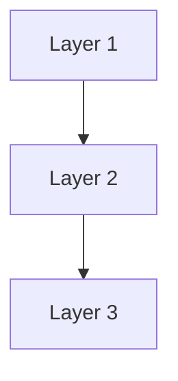
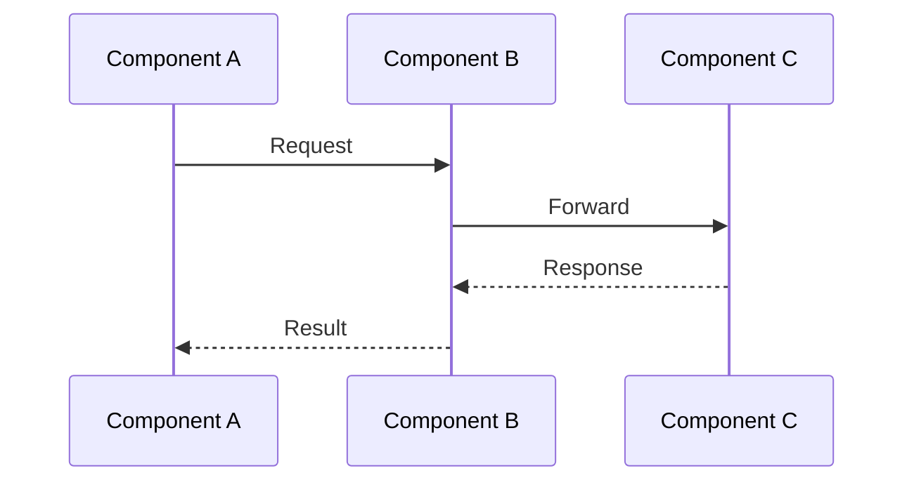

# Interactive Agent Experience Engine

**Purpose**: [Brief 1-2 sentence description of what this plan accomplishes]

**Status**: Draft
**Last Updated**: 2026-01-07
**Author**: Sergey

---

## Overview

[Brief summary - what this document covers, audience, key outcomes]

### Key Statistics
- **Total components**: X
- **Files affected**: Y
- **Estimated effort**: Z days
- **Risk level**: Low | Medium | High

---

## Table of Contents
1. [Architecture Principles](#architecture-principles)
2. [System Components](#system-components)
3. [Data Flow](#data-flow)
4. [Security Guarantees](#security-guarantees)

---

## Architecture Principles

### [Principle Name]
[Description with rationale]

**Key Characteristics:**
- Point 1
- Point 2
- Point 3

### Defense in Depth / Layered Approach

## System Components

### Component 1
- Description
- Responsibilities
- Integration points

### Component 2
- Description
- Responsibilities
- Integration points

## Data Flow

## Security Guarantees

### Security Checklist
- [ ] SQL injection prevention (parameterized queries)
- [ ] RBAC enforcement on all data access
- [ ] Input validation and sanitization
- [ ] Audit logging for sensitive operations
- [ ] Error handling doesn't leak sensitive data

### Compliance Features
- GDPR compliance
- SOX compliance
- HIPAA compliance

## Related Documentation

- [Related Doc](path) - Description
- [Related Doc](path) - Description

---

## Implementation Checklist

### Pre-Implementation
- [ ] Review and approve design
- [ ] Set up testing environment
- [ ] Back up affected systems

### Implementation
- [ ] Complete Phase 1 tasks
- [ ] Complete Phase 2 tasks
- [ ] [Continue phases]

### Post-Implementation
- [ ] Run full test suite
- [ ] Perform security review
- [ ] Update documentation
- [ ] Train team on changes

---

## Key Statistics Summary

| Metric | Value |
|--------|-------|
| Total documentation lines | X |
| Code examples | Y |
| Patterns documented | Z |
| Files analyzed | N |

---

**Last Updated**: 2026-01-07
**Version History**:
| Version | Date | Author | Notes |
|---------|------|--------|-------|
| 0.1 | 2026-01-07 | Sergey | Initial draft |

